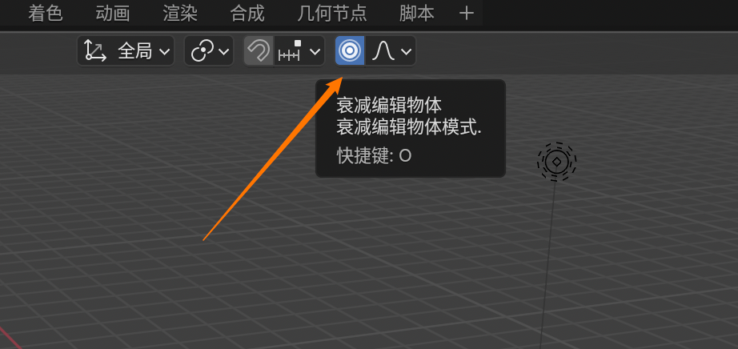

# 快捷键

## 操作

* 鼠标滚轮：缩放
* shift + 鼠标滚轮：平移
* 鼠标中键：旋转

## 变换

* w：选择
* space： 游标
* shift + 鼠标右键：将游标移动到当前位置
* shift + c：游标移动到世界原点
* g：移动（+x +y +z）移动指定轴
* r：旋转（+x +y +z）旋转指定轴
* s：缩放（+x +y +z）缩放指定轴
* r + r:绕当前面旋转

## 工作区

* shift + a：添加物体
* x：删除
* ~：切换相机
* shift + 鼠标左键：（多）选择物体
* shift + d：复制
* f9：添加物体后的详细属性选项
* shift + s：设置游标
* o：衰减模式:可以将物体做到柔性，按下g，+x,y,z和滚轮拖拽
* alt + d：关联复制
* ctrl + b：倒角
* ctrl + 2：细分
* m：合并成collection，编辑模式下是合并定点，面，线
* i：编辑模式下，面模式下，挤出面
* e：编辑模式下，面模式下，拉伸面

