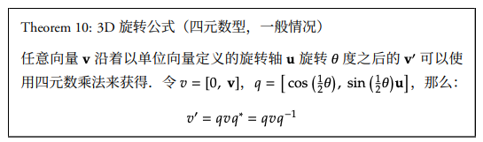

# Math

## Vector

### 定义

向量是具有大小和方向的量
### 运算

#### 加法
将两个向量的对应分量相加
#### 减法
将两个向量的对应分量相减
#### 数乘
将一个数与一个向量的每个分量相乘
#### 点乘（内积）
向量点积使用 a・b 表示，返回一个标量

代数含义：
表示两个向量对应位置上的值相乘再相加的操作，其结果即为点积
$$\vec{a} \cdot \vec{b} = x_a x_b + y_a y_b + z_a z_b $$

几何含义：
表示点积是两个向量的长度与它们夹角余弦的积

$$\vec{a} \cdot \vec{b} =|\vec{a}|\ |\vec{b}| \cos \theta $$
#### 叉乘（外积）
只适用于三维向量，结果是一个新的向量，垂直于原始两个向量所在的平面。

代数意义:
表示行列式的计算的对应量 $\begin{vmatrix} x_a & y_a & z_a \\ x_b & y_b & z_b \\ X & Y & Z \end{vmatrix}$ ,
计算结果为  $(y_a z_b - z_a y_b)X + (z_a x_b - x_a z_b)Y +(x_a y_b - y_a x_b)Z$

几何意义：
根据右手定则，从 $\vec a$ 旋转到 $\vec b$ 所形成的平面，拇指指向方向结果 ,$\vec n$ 代表平面的法向量
$$\vec{a} \times \vec{b} =|\vec{a}|\ | \vec{b}| \sin \theta \vec{n} $$

### 性质

* 零向量：所有分量都为零的向量，用0表示。
* 向量的长度（模）：使用欧几里得范数（Euclidean Norm）或长度来衡量向量的大小。
* 单位向量：长度为1的向量。
* 向量的归一化：将向量转换为单位向量，即除以向量的长度。
* 向量的投影：将一个向量投影到另一个向量上，得到一个标量值或新的向量。

## Euler

### 定义
<u>欧拉角是一种</u>将三维旋转表示为一系列绕着固定坐标轴的<u>旋转角度的方法</u>。通常使用三个角度表示绕三个坐标轴的旋转，分别称为俯仰角（Pitch）、偏航角（Yaw）和滚转角（Roll）。

### 旋转顺序

* 欧拉角的旋转顺序对最终物体的方向有决定性影响。常见的旋转顺序有ZYX、ZXY、XYZ等，分别代表旋转操作的执行顺序。
* 不同的旋转顺序会导致不同的最终方向，即使是相同的欧拉角值。

### 优点与缺点

* <b>优点</b>
    * 易于理解，易于实现
* <b>缺点</b>
    * 存在万向节死锁问题（Gimbal Lock）
    * 旋转顺序的选择会影响结果
    * 不便于插值和复合旋转。
  
#### 万向节死锁问题
万向锁（Gimbal Lock）是欧拉角在特定情况下遇到的问题，当其中两个旋转轴重合时，系统会失去一个自由度，这意味着无法独立使用第三个旋转来达到所有的空间方向。这个问题会限制物体的旋转能力，导致无法表达某些方向。

#### 解决方案
使用四元数或旋转矩阵

## Quaternion

### 定义
四元数是一种用于表示三维空间中旋转的数学工具，是复数的一个扩展，由一个实数部分和三个虚数部分组成，形式为 q=w+xi+yj+zk ，其中w,x,y,z是实数，i,j,k是虚数单位。

### 理解
一个四元数 q 可以表示为 q = cos(θ/2) + u * sin(θ/2)，其中 θ 是旋转角度，u 是单位旋转轴向量。

例如，对于绕以 (1, 0, 0) 为轴，角度为 π/2 的旋转操作，可以构建四元数 q = cos(π/4) + i * sin(π/4)。这个四元数表示了绕 x 轴正方向旋转 π/2 的操作。

### 旋转

### 运算

#### 乘法
用于组合旋转。注意，四元数乘法不满足交换律

#### 归一化
由于计算过程中可能累积的误差，经常需要将四元数归一化，以确保它们表示有效的单位旋转。

#### 逆四元数
于计算逆旋转，如果四元数q表示一个旋转，那么它的逆q^−1表示相反的旋转。

### 优点与缺点
* <b>优点</b>
    * 插值友好,非常适合于旋转的插值，如球面线性插值（Slerp）
    * 效率高且稳定,四元数运算通常比对应的矩阵运算更简单、更快
    * 避免万向锁,不依赖于旋转轴的顺序。
* <b>缺点</b>
    * 过于抽象，难以理解

## Matrix

# Graphics

# WebGL

# Three
