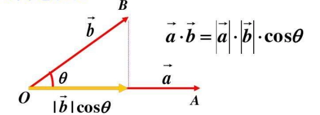

# Math

## Vector

### 定义

向量是具有大小和方向的量
### 运算

#### 加法
将两个向量的对应分量相加
#### 减法
将两个向量的对应分量相减
#### 数乘
将一个数与一个向量的每个分量相乘
#### 点乘（内积）
向量点积使用 a・b 表示，返回一个标量

代数含义：
表示两个向量对应位置上的值相乘再相加的操作，其结果即为点积
$$\vec{a} \cdot \vec{b} = x_a x_b + y_a y_b + z_a z_b $$

几何含义：
表示点积是两个向量的长度与它们夹角余弦的积

$$\vec{a} \cdot \vec{b} =|\vec{a}|\ |\vec{b}| \cos \theta $$
#### 叉乘（外积）
只适用于三维向量，结果是一个新的向量，垂直于原始两个向量所在的平面。

代数意义:
表示行列式的计算的对应量 $\begin{vmatrix} x_a & y_a & z_a \\ x_b & y_b & z_b \\ X & Y & Z \end{vmatrix}$ ,
计算结果为  $(y_a z_b - z_a y_b)X + (z_a x_b - x_a z_b)Y +(x_a y_b - y_a x_b)Z$

几何意义：
根据右手定则，从 $\vec a$ 旋转到 $\vec b$ 所形成的平面，拇指指向方向结果 ,$\vec n$ 代表平面的法向量
$$\vec{a} \times \vec{b} =|\vec{a}|\ | \vec{b}| \sin \theta \vec{n} $$

### 性质

* 零向量：所有分量都为零的向量，用0表示。
* 向量的长度（模）：使用欧几里得范数（Euclidean Norm）或长度来衡量向量的大小。
* 单位向量：长度为1的向量。
* 向量的归一化：将向量转换为单位向量，即除以向量的长度。
* 向量的投影：将一个向量投影到另一个向量上，得到一个标量值或新的向量。

## Euler

### 定义
<u>欧拉角是一种</u>将三维旋转表示为一系列绕着固定坐标轴的<u>旋转角度的方法</u>。通常使用三个角度表示绕三个坐标轴的旋转，分别称为俯仰角（Pitch）、偏航角（Yaw）和滚转角（Roll）。

### 旋转顺序

* 欧拉角的旋转顺序对最终物体的方向有决定性影响。常见的旋转顺序有ZYX、ZXY、XYZ等，分别代表旋转操作的执行顺序。
* 不同的旋转顺序会导致不同的最终方向，即使是相同的欧拉角值。

## Quaternion

## Matrix

# Graphics

# WebGL

# Three
