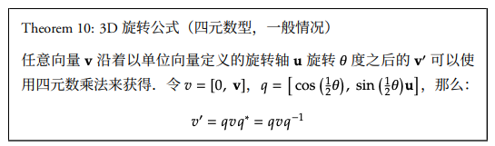

## 定义
四元数是一种用于表示三维空间中旋转的数学工具，是复数的一个扩展，由一个实数部分和三个虚数部分组成，形式为 q=w+xi+yj+zk ，其中w,x,y,z是实数，i,j,k是虚数单位。

## 理解
一个四元数 q 可以表示为 q = cos(θ/2) + u * sin(θ/2)，其中 θ 是旋转角度，u 是单位旋转轴向量。

例如，对于绕以 (1, 0, 0) 为轴，角度为 π/2 的旋转操作，可以构建四元数 q = cos(π/4) + i * sin(π/4)。这个四元数表示了绕 x 轴正方向旋转 π/2 的操作。

## 旋转

## 运算

### 乘法
用于组合旋转。注意，四元数乘法不满足交换律

### 归一化
由于计算过程中可能累积的误差，经常需要将四元数归一化，以确保它们表示有效的单位旋转。

### 逆四元数
于计算逆旋转，如果四元数q表示一个旋转，那么它的逆q^−1表示相反的旋转。

## 优点与缺点
* <b>优点</b>
    * 插值友好,非常适合于旋转的插值，如球面线性插值（Slerp）
    * 效率高且稳定,四元数运算通常比对应的矩阵运算更简单、更快
    * 避免万向锁,不依赖于旋转轴的顺序。
* <b>缺点</b>
    * 过于抽象，难以理解
