<!--
 * @Date: 2023-12-12 16:52:07
 * @LastEditors: wuyifan wuyifan@max-optics.com
 * @LastEditTime: 2023-12-12 19:29:22
 * @FilePath: /Obsidian Vault/graphics/webgl/0.webgl入门.md
-->
# WEBGL入门

## WebGL 是什么

WebGL（Web图形库）是一个JavaScript API，可在任何兼容的Web浏览器中渲染高性能的交互式3D和2D图形，而无需使用插件。
WebGL通过引入一个与OpenGL ES 2.0非常一致的API来做到这一点，该API可以在HTML5 <canvas>元素中使用。
这种一致性使API可以利用用户设备提供的硬件图形加速。

## WebGL 发展史

WebGL 的发展最早要追溯到 2006 年，WebGL 起源于 Mozilla 员工弗拉基米尔·弗基西维奇的一项 Canvas 3D 实验项目，并于 2006 年首次展示了 Canvas 3D 的原型。这一技术在 2007 年底在 FireFox 和 Opera 浏览器中实现。2009 年初 Khronos Group 联盟创建了 WebGL 的工作组最初的工作成员包括 Apple、Google、Mozilla、Opera 等。 2011 年 3 月 WebGL 1.0 规范发布，WebGL 2 规范的发展始于 2013 年，并于 2017 年 1 月最终完成，WebGL 2 的规范，首度在 Firefox 51、Chrome 56 和 Opera 43 中被支持。

## 渲染管线
Webgl的渲染依赖底层GPU的渲染能力。所以WEBGL 渲染流程和 GPU 内部的渲染管线是相符的。
渲染管线的作用是将3D模型转换为2维图像。
在早期，渲染管线是不可编程的，叫做固定渲染管线，工作的细节流程已经固定，修改的话需要调整一些参数。
现代的 GPU 所包含的渲染管线为可编程渲染管线，可以通过编程 GLSL 着色器语言 来控制一些渲染阶段的细节。
简单来说： 就是使用shader，我们可以对画布中每个像素点做处理，然后就可以生成各种酷炫的效果了。

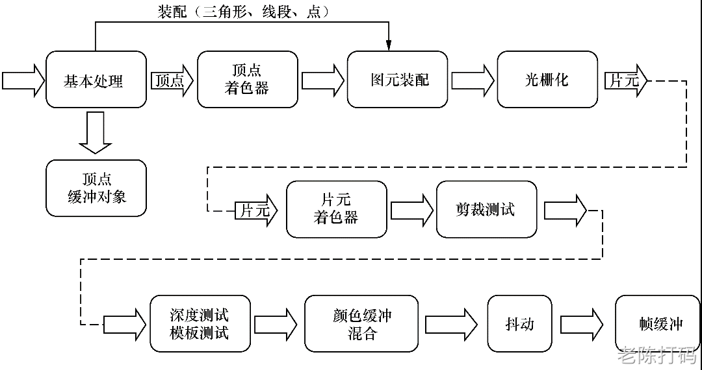

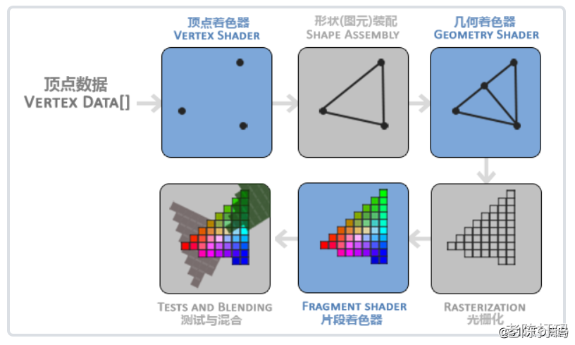

# 渲染过程
渲染过程大概经历了下面这么多过程， 因为本篇文章的重点其实是在着色器，所以我重点分析从顶点着色器 ——> 片元着色器的一个过程
* 顶点着色器
* 图片装配
* 光栅化
* 片元着色器
* 裁剪测试
* 多重采样操作
* 背面剔除
* 模板测试
* 深度测试
* 融合
* 缓存

## 顶点着色器

WebGL就是和GPU打交道，在GPU上运行的代码是一对着色器，一个是顶点着色器，另一个是片元着色器。每次调用着色程序都会先执行顶点着色器，再执行片元着色器。

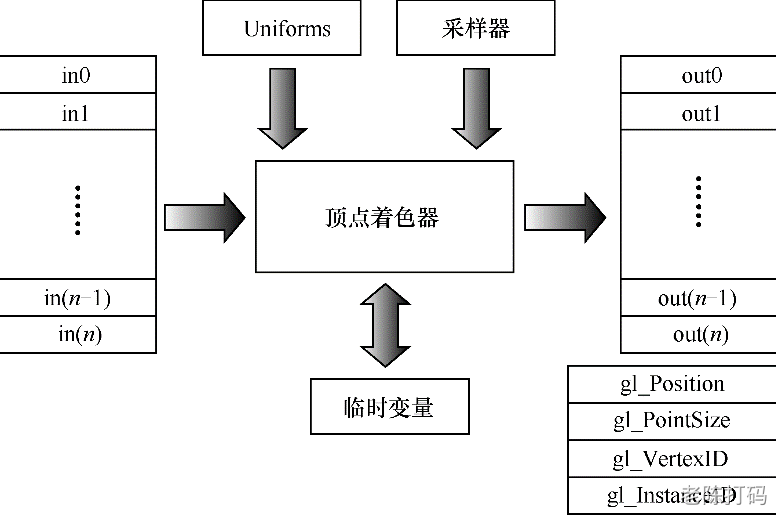
一个顶点着色器的工作是生成裁剪空间坐标值，通常是以下的形式：

```javascript
const vertexShaderSource = `
    attribute vec3 position; 
    void main() {
        gl_Position = vec4(position,1); 
    }
`
```

每个顶点调用一次（顶点）着色器，每次调用都需要设置一个特殊的全局变量 gl_Position。 该变量的值就是裁减空间坐标值。 这里有同学就问了， 什么是裁剪空间的坐标值？？？
其实我之前有讲过，我在讲一遍。
何为裁剪空间坐标？就是无论你的画布有多大，裁剪坐标的坐标范围永远是 -1 到 1 。
看下面这张图：

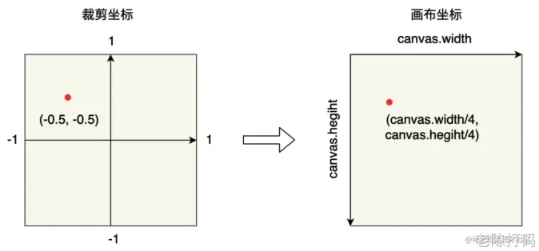

如果运行一次顶点着色器， 那么gl_Position 就是 （-0.5，-0.5，0，1） 记住他永远是个 Vec4, 简单理解就是对应x、y、z、w。即使你没用其他的，也要设置默认值， 这就是所谓的 3维模型转换到我们屏幕中。
顶点着色器需要的数据，可以通过以下四种方式获得。
1. attributes 属性（从缓冲读取数据）
2. uniforms 全局变量 （一般用来对物体做整体变化、 旋转、缩放）
3. textures 纹理（从像素或者纹理获得数据）
4. varyings 变量 （将顶点着色器的变量 传给 片元着色器）

## 图元装配和光栅化

什么是图元？
描述各种图形元素的函数叫做图元，描述几何元素的称为几何图元（点，线段或多边形）。
点和线是最简单的几何图元 经过顶点着色器计算之后的坐标会被组装成组合图元。
通俗解释：图元就是一个点、一条线段、或者是一个多边形。

什么是图元装配呢？
简单理解就是说将我们设置的顶点、颜色、纹理等内容组装称为一个可渲染的多边形的过程。
组装的类型取决于： 你最后绘制选择的图形类型

```javascript
gl.drawArrays(gl.TRIANGLES, 0, 3)
```
如果是三角形的话，顶点着色器就执行三次

## 光栅化
什么是光栅化：
通过图元装配生成的多边形，计算像素并填充，剔除不可见的部分，剪裁掉不在可视范围内的部分。最终生成可见的带有颜色数据的图形并绘制。
光栅化流程图解：
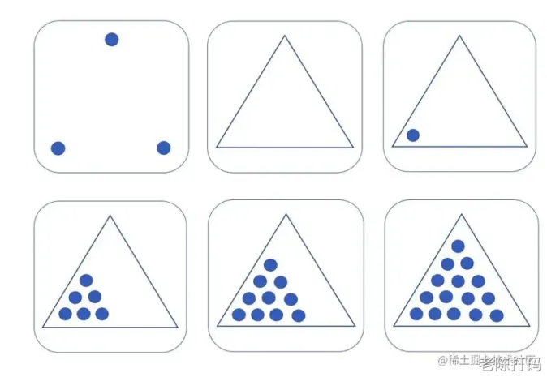

## 剔除和剪裁

* 剔除：在日常生活中，对于不透明物体，背面对于观察者来说是不可见的。同样，在webgl中，我们也可以设定物体的背面不可见，那么在渲染过程中，就会将不可见的部分剔除，不参与绘制。节省渲染开销。
  


* 剪裁：日常生活中不论是在看电视还是观察物体，都会有一个可视范围，在可视范围之外的事物我们是看不到的。类似的，图形生成后，有的部分可能位于可视范围之外，这一部分会被剪裁掉，不参与绘制。以此来提高性能。这个就是视椎体， 在📷范围内能看到的东西，才进行绘制。


## 片元着色器

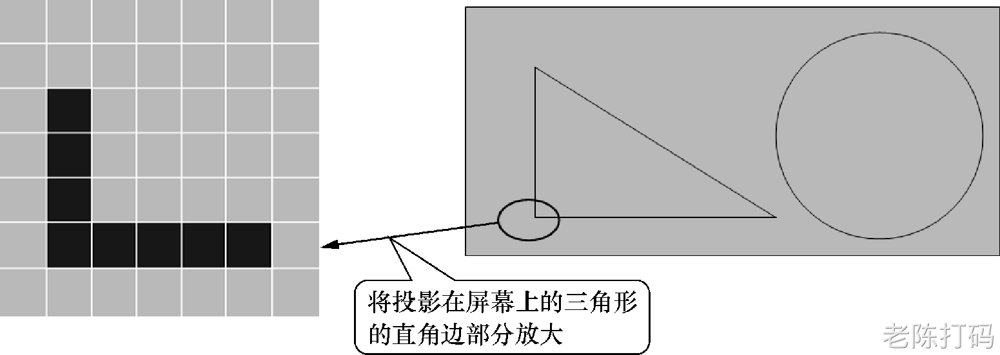

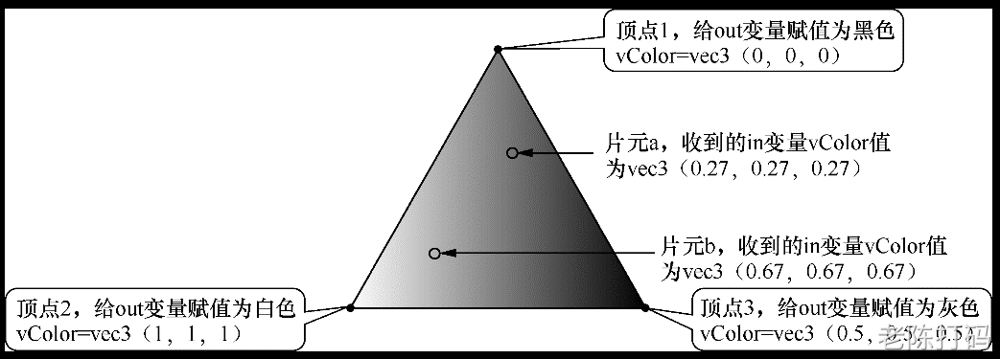

光珊化后，每一个像素点都包含了 颜色 、深度 、纹理数据， 这个我们叫做片元
小tips ： 每个像素的颜色由片元着色器的gl_FragColor提供
接收光栅化阶段生成的片元，在光栅化阶段中，已经计算出每个片元的颜色信息，这一阶段会将片元做逐片元挑选的操作，处理过的片元会继续向后面的阶段传递。 片元着色器运行的次数由图形有多少个片元决定的。

逐片元挑选
通过模板测试和深度测试来确定片元是否要显示，测试过程中会丢弃掉部分无用的片元内容，然后生成可绘制的二维图像绘制并显示。
* 深度测试： 就是对 z 轴的值做测试，值比较小的片元内容会覆盖值比较大的。（类似于近处的物体会遮挡远处物体）。
* 模板测试： 模拟观察者的观察行为，可以接为镜像观察。标记所有镜像中出现的片元，最后只绘制有标记的内容。

# 实战——绘制个三角形

在进行实战之前，我们先给你看一张图，让你能大概了解，用原生webgl生成一个三角形需要那些步骤：

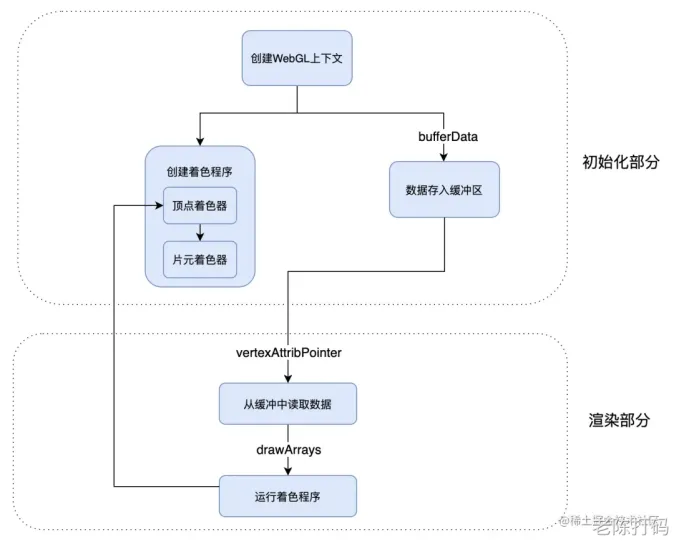

我们就跟着这个流程图一步一步去操作：
## 初始化CANVAS
新建一个webgl画布
```html
<canvas id="webgl" width="500" height="500"></canvas>
```

创建webgl 上下文：
```javascript
const gl = document.getElementById('webgl').getContext('webgl')
```

## 创建着色器程序
着色器的程序这些代码，其实是重复的，我们还是先看下图，看下我们到底需要哪些步骤：
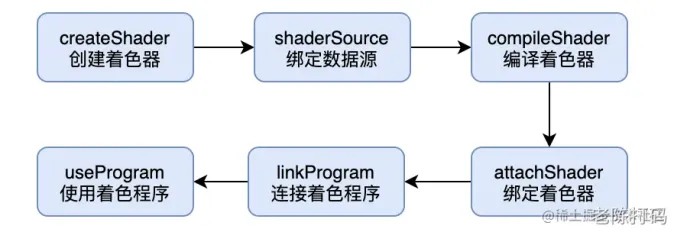
那我们就跟着这个流程图： 一步一步来好吧。

### 创建着色器
```javascript
 const vertexShader = gl.createShader(gl.VERTEX_SHADER)
 const fragmentShader = gl.createShader(gl.FRAGMENT_SHADER)
```
gl.VERTEX_SHADER 和 gl.FRAGMENT_SHADER 这两个是全局变量 分别表示顶点着色器 和片元着色器

## 绑定数据源
顾名思义： 数据源，也就是我们的着色器 代码。
编写着色器代码有很多种方式：
1. 用 script 标签 type notjs 这样去写
2. 模板字符串 （比较喜欢推荐这种）
我们先写顶点着色器:
```javascript
const vertexShaderSource = `
    attribute vec4 a_position;
    void main() {
        gl_Position = a_position;
    }
 `
```
顶点着色器 必须要有 main 函数 ，他是强类型语言， 记得加分号哇 不是js 兄弟们。 我这段着色器代码非常简单 定义一个vec4 的顶点位置， 然后传给 gl_Position
这里有小伙伴会问 ？ 这里a_position一定要这么搞？？
这里其实是这样的哇， 就是我们一般进行变量命名的时候 都会的前缀 用来区分 他是属性 还是 全局变量 还是纹理 比如这样：

```javascript
uniform mat4 u_mat;
```
表示个矩阵，如果不这样也可以哈。 但是要专业呗，防止bug 影响。
我们接着写片元着色器：
```javascript
const fragmentShaderSource = `
    void main() {
        gl_FragColor = vec4(1.0,0.0,0.0,1.0);
    }
`
```
这个其实理解起来非常简单哈， 每个像素点的颜色 是红色 ， gl_FragColor 其实对应的是 rgba 也就是颜色的表示。
有了数据源之后开始绑定：
```javascript
// 创建着色器
const vertexShader = gl.createShader(gl.VERTEX_SHADER)
const fragmentShader = gl.createShader(gl.FRAGMENT_SHADER)
//绑定数据源
gl.shaderSource(vertexShader, vertexShaderSource)
gl.shaderSource(fragmentShader, fragmentShaderSource)
```

## 后面着色器的一些操作
其实后面编译着色器、绑定着色器、连接着色器程序、使用着色器程序 都是一个api 搞定的事不多说了 直接看代码：
```javascript
// 编译着色器
gl.compileShader(vertexShader)
gl.compileShader(fragmentShader)
// 创建着色器程序
const program = gl.createProgram()
gl.attachShader(program, vertexShader)
gl.attachShader(program, fragmentShader)
// 链接 并使用着色器
gl.linkProgram(program)
gl.useProgram(program)
```
这样我们就创建好了一个着色器程序了。
这里又有人问，我怎么知道我创建的着色器是对的还是错的呢？ 我就是很粗心的人呢？？？ 好的他来了 如何调试：
```javascript
const success = gl.getProgramParameter(program, gl.LINK_STATUS)
if (success) {
  gl.useProgram(program)
  return program
}
console.error(gl.getProgramInfoLog(program), 'test---')
gl.deleteProgram(program)
```
getProgramParameter 这个方法用来判断 我们着色器 glsl 语言写的是不是对的， 然后你可以通过 getProgramInfoLog这个方法 类似于打 日志 去发现❌了。

## 数据存入缓冲区
有了着色器，现在我们差的就是数据了对吧。
上文在写顶点着色器的时候用到了Attributes属性，说明是这个变量要从缓冲中读取数据，下面我们就来把数据存入缓冲中。
首先创建一个顶点缓冲区对象（Vertex Buffer Object, VBO
```javascript
const buffer = gl.createBuffer()
```
gl.createBuffer()函数创建缓冲区并返回一个标识符,接下来需要为WebGL绑定这个buffer
```javascript
gl.bindBuffer(gl.ARRAY_BUFFER, buffer)
```
gl.bindBuffer()函数把标识符buffer设置为当前缓冲区，后面的所有的数据都会都会被放入当前缓冲区，直到bindBuffer绑定另一个当前缓冲区。
我们新建一个数组 然后并把数据存入到缓冲区中。
```javascript
const data = new Float32Array([0.0, 0.0, -0.3, -0.3, 0.3, -0.3])
gl.bufferData(gl.ARRAY_BUFFER, data, gl.STATIC_DRAW)
```
因为JavaScript与WebGL通信必须是二进制的，不能是传统的文本格式，所以这里使用了ArrayBuffer对象将数据转化为二进制，因为顶点数据是浮点数,精度不需要太高，所以使用Float32Array就可以了，这是JavaScript与GPU之间大量实时交换数据的有效方法。
* gl.STATIC_DRAW 指定数据存储区的使用方法： 缓存区的内容可能会经常使用，但是不会更改
* gl.DYNAMIC_DRAW 表示 缓存区的内容经常使用，也会经常更改。
* gl.STREAM_DRAW 表示缓冲区的内容可能不会经常使用

## 从缓冲中读取数据
GLSL着色程序的唯一输入是一个属性值a_position。 我们要做的第一件事就是从刚才创建的GLSL着色程序中找到这个属性值所在的位置。
```javascript
const aposlocation = gl.getAttribLocation(program, 'a_position')
```
接下来我们需要告诉WebGL怎么从我们之前准备的缓冲中获取数据给着色器中的属性。 首先我们需要启用对应属性
```javascript
gl.enableVertexAttribArray(aposlocation)
```
最后是从缓冲中读取数据绑定给被激活的aposlocation的位置
```javascript
gl.vertexAttribPointer(aposlocation, 2, gl.FLOAT, false, 0, 0)
```
gl.vertexAttribPointer()函数有六个参数：
1. 读取的数据要绑定到哪
2. 表示每次从缓存取几个数据，也可以表示每个顶点有几个单位的数据，取值范围是1-4。这里每次取2个数据，之前vertices声明的6个数据，正好是3个顶点的二维坐标。
3. 表示数据类型，可选参数有gl.BYTE有符号的8位整数，gl.SHORT有符号的16位整数，gl.UNSIGNED_BYTE无符号的8位整数，gl.UNSIGNED_SHORT无符号的16位整数，gl.FLOAT32位IEEE标准的浮点数。
4. 表示是否应该将整数数值归一化到特定的范围，对于类型gl.FLOAT此参数无效。
5. 表示每次取数据与上次隔了多少位，0表示每次取数据连续紧挨上次数据的位置，WebGL会自己计算之间的间隔。
6. 表示首次取数据时的偏移量，必须是字节大小的倍数。0表示从头开始取。

## 渲染
现在着色器程序 和数据都已经ready 了， 现在就差渲染了。 渲染之前和2d canvas 一样做一个清除画布的动作：
```javascript
// 清除canvas
gl.clearColor(0, 0, 0, 0)
gl.clear(gl.COLOR_BUFFER_BIT)
```
我们用0、0、0、0清空画布，分别对应 r, g, b, alpha （红，绿，蓝，阿尔法）值， 所以在这个例子中我们让画布变透明了。
开启绘制三角形：
```javascript
gl.drawArrays(gl.TRIANGLES, 0, 3)
```
1. 第一个参数表示绘制的类型
2. 第二个参数表示从第几个顶点开始绘制
3. 第三个参数表示绘制多少个点，缓冲中一共6个数据，每次取2个，共3个点
绘制类型共有下列几种 看图：

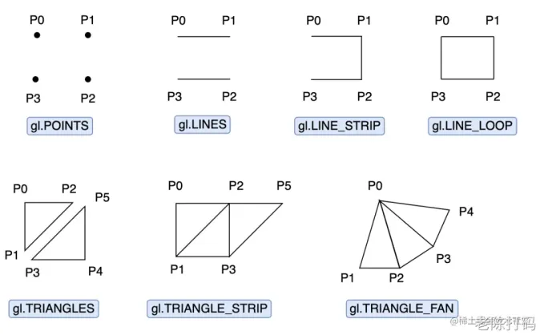

这里我们看下画面是不是一个红色的三角形 ：

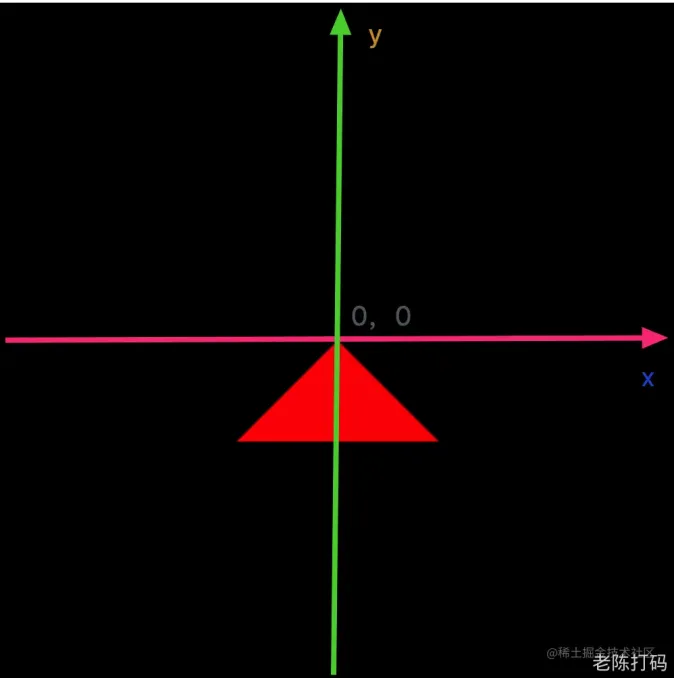

我们创建的数据是这样的：
画布的宽度是 500 * 500 转换出来的实际数据其实是这样的
```JavaScript
0，0  ====>  0，0 
-0.3, -0.3 ====> 175, 325
0.3, -0.3 ====>  325, 325
```

## 矩阵的使用
有了静态的图形我们开始着色器，对三角形做一个缩放。
改写顶点着色器： 其实在顶点着色器上加一个全局变量 这就用到了 着色器的第二个属性 uniform

```javascript
 const vertexShaderSource = `
  attribute vec4 a_position;
  // 添加矩阵代码
  uniform mat4 u_mat;
  void main() {
      gl_Position = u_mat * a_position;
  }
`
```
然后和属性一样，我们需要找到 uniform 对应的位置：
```javascript
const matlocation = gl.getUniformLocation(program, 'u_mat')
```
然后初始化一个缩放举证：
```javascript
// 初始化一个旋转矩阵。
  const mat = new Float32Array([
    Tx,  0.0, 0.0, 0.0,
    0.0,  Ty, 0.0, 0.0,
    0.0, 0.0,  Tz, 0.0,
    0.0, 0.0, 0.0, 1.0,
  ]);
```
Tx, Ty, Tz 对应的其实就是 x y z 轴缩放的比例。
最后一步， 将矩阵应用到着色器上， 在画之前， 这样每个点 就可以✖️ 这个缩放矩阵了 ，所以整体图形 也就进行了缩放。
```javascript
gl.uniformMatrix4fv(matlocation, false, mat)
```
三个参数分别代表什么意思：
1. 全局变量的位置
2. 是否为转置矩阵
3. 矩阵数据

最后 给大家看一下webgl 内部是怎么搞的

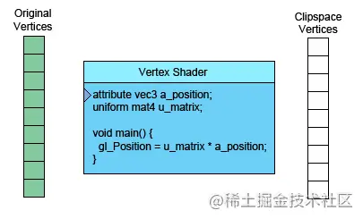

## 变量的使用
说完矩阵了下面👇，我们开始说下着色器中的varying 这个变量 是如何和片元着色器进行联动的。
我们还是继续改造顶点着色器：
```javascript
const vertexShaderSource = `
  attribute vec4 a_position;
  uniform mat4 u_mat;
  // 变量
  varying vec4 v_color;
  void main() {
      gl_Position = u_mat * a_position;
      v_color =  gl_Position * 0.5 + 0.5;
  }
`
```
这里有一个小知识 ， gl_Position 他的值范围是 -1 至 1 但是片元着色 他是颜色 他的范围是 0 至 1 ， 所以呢这时候呢，我们就要 做一个范围转换 所以为什么要 乘 0.5 在加上 0.5 了， 希望你们明白。
改造下片元着色器：
```javascript
const fragmentShaderSource = `
    precision lowp float;
    varying vec4 v_color;
    void main() {
        gl_FragColor = v_color;
    }
`
```
只要没一个像素点 改为由顶点着色器传过来的就好了。
本质是在三角形的三个顶点， 做线性插值的过程：

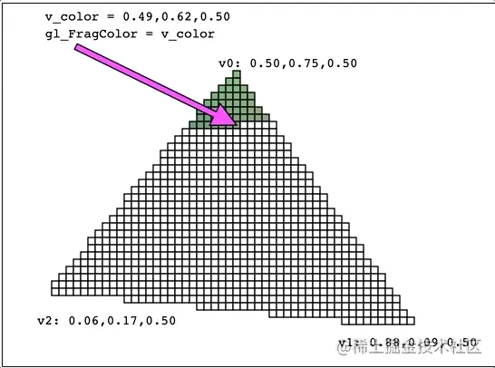