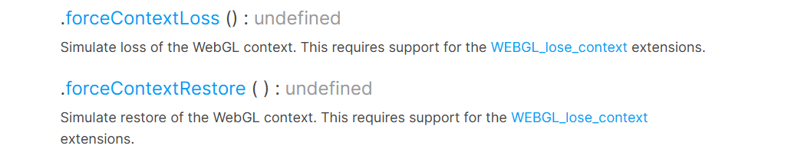
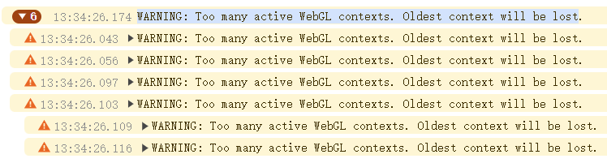
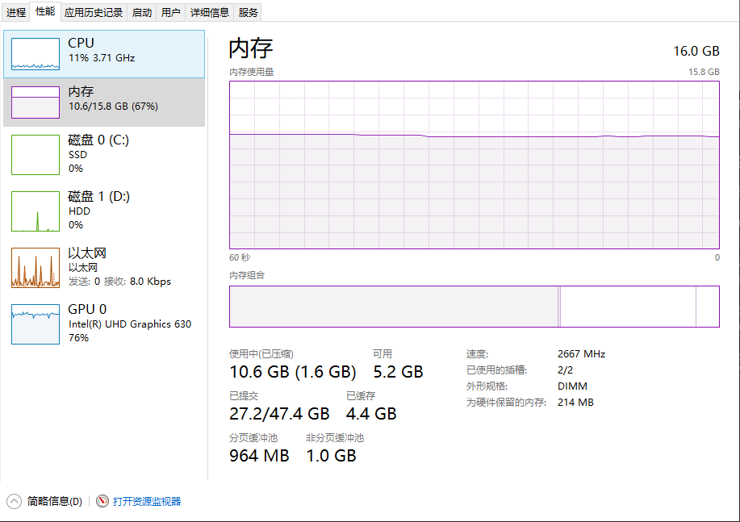
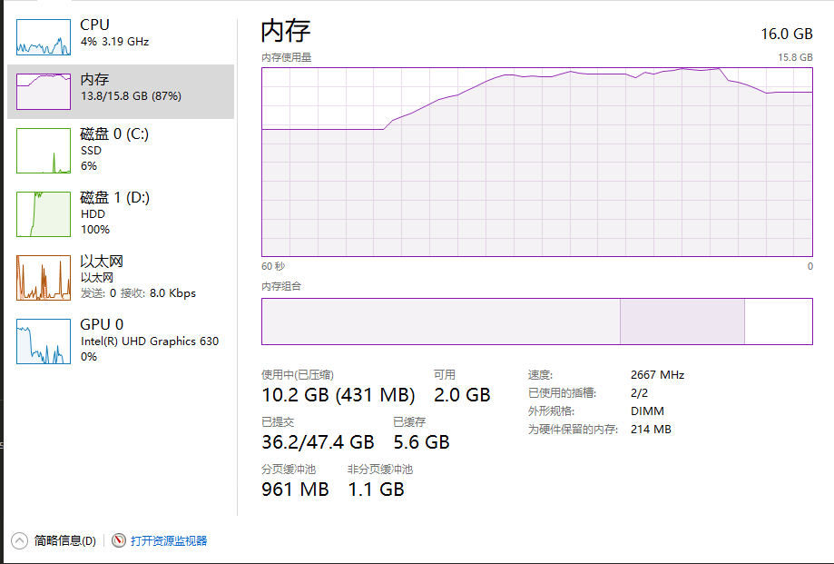
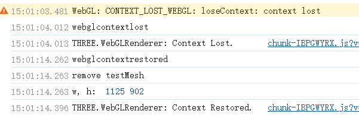

# WebGLContext Lost and Restore

## WebGLContext 简介

WebGLContext（即 WebGL 上下文）是浏览器在使用 GPU（图形处理器）进行绘制时所依赖的一个**渲染上下文**。可以理解为浏览器与显卡之间的一座“桥梁”，通过它才能将 JavaScript 发出的绘制命令真正地在 GPU 中执行。一个页面通常会通过 `<canvas>` 标签获取到这个上下文，然后使用相关的 WebGL API 调用 GPU 资源。

---

## Context 丢失原因

以下几个常见原因:

1. **GPU 资源紧张或显存不足**
   - 浏览器或操作系统在检测到显存压力时，可能回收不活跃或占用过大的 GPU 上下文。
   - 移动端或多网页同开时尤为明显。
2. **浏览器/显卡驱动异常**
   - 显卡驱动崩溃、重启，或浏览器自身出现故障，都可能造成上下文被强制中断。
   - 在这种情况下，浏览器为了防止崩溃会直接丢失/回收 WebGL 上下文。
3. **页面占用大量 GPU 资源**
   - 过多的纹理、离屏渲染目标（Framebuffer）、或同时创建了多份 WebGLContext。
   - 浏览器为了自保（防止死锁或卡死），会选择丢失部分上下文。
4. **用户操作或系统层面切换**
   - 某些情境：浏览器 Tab 长时间后台、系统切换 GPU（集显/独显自动切换）等，可能触发上下文丢失。

---

## Context 丢失的影响

当 WebGL Context 丢失时，实际上**GPU 中分配给当前渲染上下文的所有资源都会被释放**，

这些资源包括：

- 纹理（Textures）
- 缓冲区对象（Buffer Objects）
- 帧缓冲区（Framebuffer）
- 渲染缓冲区（Renderbuffer）
- 着色器、程序对象（Shader / Program）

一旦出现 webglcontextlost 事件，**在没有被恢复（restore）之前，所有的 WebGL 操作将会失败**，也无法提交新的绘制指令给 GPU。WebGL 会暂时处于“不可用”状态。

---

## 如何避免（或尽量降低）发生

完全避免 Context 丢失并不现实，但可以通过以下手段来降低丢失的概率：

1. **合理分配 GPU 资源**
   - 纹理大小要适量，尤其在移动端，避免使用超大纹理。
   - 动态创建和销毁 WebGL 资源时，及时释放不再使用的缓冲区或纹理。
2. **减少不必要的离屏渲染**  
   离屏渲染（Framebuffer）通常会占用额外的显存，只有在确实需要后处理或特效时才使用。
3. **控制同页面内的多个 WebGL Context 数量**  
   如果可能，尽量使用单一或少量 WebGL 上下文，避免同一页面频繁地 new WebGL contexts。

4. **分配内存要谨慎**
   尽量确保所有数据都可控，如纹理数据、模型数据等都进行必要的压缩或者分块加载，不一次性给 GPU “爆量”传输。

---

## Context 丢失后恢复的方式

1. **事件监听**：`webglcontextlost` 和 `webglcontextrestored`
   - 在 `webglcontextlost` 中使用 `event.preventDefault()`，来阻止浏览器默认行为（默认情况下浏览器可能直接停止试图恢复这个上下文）。
   - **不要继续调用 WebGL API** 以免报错。
2. **等待浏览器触发`webglcontextrestored`事件**
   - 一旦收到，就重新进行所有依赖 GPU 资源的初始化过程，比如重新上传纹理、重新初始化着色器等。
   - **注意**：恢复并不保证一定能成功。如果因为显卡资源不足等原因，浏览器可能会拒绝恢复。

> **在使用 three 发生 WebGLContext Lost 事件，恢复时否还需要调用 dispose()方法？**  
> - 对于 GPU:
>     - 上下文已经丢失了，无法对其做任何操作，因此不需要`dispose()`。  
>     - 注意：**丢失上下文 != GPU 资源自动释放** 。WebGL 上下文进入“丢失”状态，但并不代表那批 GPU 资源（VAO、VBO、纹理等）会立刻被回收。有时浏览器会在后台某个时机或特定触发时机才彻底销毁这些资源。这就会导致多次 context 丢失-重建后，显存看起来越来越高。
> - 对于 Three：
>     - 根据根据自身需求，如果需要复用，就不用调用。Three 会察觉“这些 GPU 资源还没上传”，就会再次调用内部的 initTexture(), initMaterial(), initGeometry() 等逻辑，将对应的数据（JS 端）上传到 GPU 中，重新编译着色器等。
>     - 如果需要重新创建，则需要再 `remove()` 后 则需要调用 `dispose()`。以便让 JS 侧引用尽早释放，避免不必要的内存占用。


> **为什么不在 `webglcontextlost` 回调中就销毁或重建？**  
> 在 `webglcontextlost` 回调里，只是得知上下文丢失了。如果此时新建上下文，那它也拿不到可用的 WebGL context。

以下是一个完整案例

```javascript
import {
  Mesh,
  MeshNormalMaterial,
  Scene,
  WebGLRenderer,
  OrthographicCamera,
  Color,
  SphereGeometry,
} from "three";
import { OrbitControls } from "three/addons/controls/OrbitControls.js";
import { GUI } from "lil-gui";

window.onload = () => {
  init();
};

function init() {
  const container = {
    renderer: null,
    scene: null,
    camera: null,
    controls: null,
    animationId: null,
  };

  const canvas = document.createElement("canvas");
  document.body.appendChild(canvas);

  function resizeCallback() {
    const [w, h] = [document.body.clientWidth, document.body.clientHeight];
    container.renderer.setSize(w, h);

    container.camera.left = -15;
    container.camera.right = 15;
    container.camera.top = 15 * (h / w);
    container.camera.bottom = -15 * (h / w);
    container.camera.updateProjectionMatrix();

    canvas.width = w;
    canvas.height = h;
  }

  window.addEventListener("resize", resizeCallback);

  function init() {
    container.renderer = new WebGLRenderer({ canvas, antialias: true });

    container.scene = new Scene();
    container.scene.background = new Color(0xaaaaaa);

    container.camera = new OrthographicCamera();
    container.camera.position.set(0, 0, 100);
    container.controls = new OrbitControls(container.camera, canvas);

    resizeCallback();

    const box = new Mesh(
      new SphereGeometry(10, 128, 128),
      new MeshNormalMaterial({ wireframe: true })
    );
    container.scene.add(box);
  }

  init();

  function animate() {
    container.controls.update();
    container.renderer.render(container.scene, container.camera);
    container.animationId = requestAnimationFrame(animate);
  }

  animate();

  function recover() {
    resizeCallback();
    // 1.清空缓存
    container.scene.background = null;
    // 2.渲染一次
    animate();
    // 3.产生变化，让其刷新
    container.scene.background = new Color(0xaaaaaa);
  }

  canvas.addEventListener("webglcontextlost", function (e) {
    console.log("webglcontextlost");
    e.preventDefault();
    cancelAnimationFrame(container.animationId);
    container.animationId = null;
  });

  canvas.addEventListener("webglcontextrestored", function () {
    console.log("webglcontextrestored");
    recover();
  });

  const params = {
    forceLost() {
      container.renderer.forceContextLoss();
    },
    restore() {
      container.renderer.forceContextRestore();
    },
  };

  const gui = new GUI();
  gui.add(params, "forceLost");
  gui.add(params, "restore");
}
```

---

# 扩展研究

## 如何复现 context lost

### 1. **使用 `WEBGL_lose_context` 扩展手动触发和恢复 (常用)**

three 的内部也采用这一方式模拟浏览器的 context lost 和 restore。



如何使用查看上方案例

1.1 需要检当前浏览器是否支持`WEBGL_lose_context`扩展

```javascript
const canvas = document.getElementById("canvas");
const gl =
  canvas.getContext("webgl") || canvas.getContext("experimental-webgl");

const ext = gl.getExtension("WEBGL_lose_context");
if (!ext) {
  console.warn("WEBGL_lose_context extension not supported!");
}
```

1.2 使用 `WEBGL_lose_context` 扩展手动触发和恢复

```javascript
ext && ext.loseContext();

ext && ext.restoreContext();
```

> 如果想完整查看当前浏览器的对于 webgl 插件的支持情况，直接访问 https://webglreport.com/  
> 如果想了解 electron 对于 webgl 插件的支持情况，在控制台中输入
>
> ```javascript
> window.location.href = "https://webglreport.com";
> ```

### 2. **创建大量 webgl 上下文**

手动创建大量 webgl 上下文。  

可以将以下代码直接复制到控制台中，然后观察控制台的输出

```javascript
// 上下文容器
const contexts = [];

for (let i = 0; i <= 20; i++) {
  const canvas = document.createElement("canvas");
  canvas.idx = i;
  document.body.appendChild(canvas);
  contexts.push(canvas.getContext("webgl"));

  canvas.addEventListener("webglcontextlost", function (e) {
    // 能看到lost的输出
    console.log(canvas.idx, "webglcontextlost");
    e.preventDefault();
    const gl = contexts[canvas.idx];
    const ext = gl.getExtension("WEBGL_lose_context");
    // 输出为null
    console.log("ext: ", ext);
    if (ext) {
      ext.restoreContext();
    }
  });

  canvas.addEventListener("webglcontextrestored", function (e) {
    // 始终看不到 webglcontextrestored的输出
    console.log(canvas.idx, "webglcontextrestored");
  });
}
```

如果页面同时有多个 WebgL Context，会报 `WARNING: Too many active WebGL contexts. Oldest context will be lost` 的警告  
  
由于浏览器的资源管理行为，被强制丢弃的最旧 context 不会自动进入可恢复状态，浏览器的策略就是直接回收掉  
因此只会触发 `webglcontextlost` 事件，不会触发 `webglcontextrestored` 事件。

### 3. **手动内存泄漏**

电脑配置找一个差一点的电脑，比较好复现

只创建geometry，然后不断修改 geometry，不调用dispose();

```javascript
let i = 0;
const maxCount = 450;

const testMesh = new Mesh(new BUfferGeometry(), new MeshNormalMaterial());
scene.add(testMesh);

const timer = setInterval(() => {
   if (i >= params.times) {
      clearInterval(timer);
   }
   testMesh.geometry = new SphereGeometry(Math.random() * 10, 1024, 1024));
}, 20);
```

运行前内存

运行后内存

可以看到内存一直增长，直到达到上限，此时context丢失，内存被回收，下降后context 开始 restore。

控制台输出  
