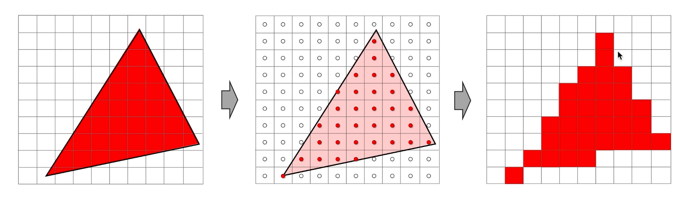

# 渲染管线概述

## 第一阶段 - 应用阶段（CPU）

### 1. 将数据传入显存
数据从硬盘(HHD),加载到内存中(RAM),再将纹理、Mesh等数据加载到显存(VRAM)中。
显卡对显存的访问非常快，数据从内存到显存只需要几纳秒，但数据从硬盘到内存需要数毫秒。
数据指准备好场景数据，相机位置，视锥体，几何体信息，光源贴图等，
其中数据从硬盘到内存最为耗时。

### 2. 设置渲染状态
设置渲染状态，如：清屏颜色、混合模式、深度测试、多边形填充模式、使用的哪个vertex Shader，使用的什么光源，材质等

### 3. 调用Draw call绘制
选择绘制的图元类型，发出绘制的命令

## 第二阶段 - 几何阶段 (GPU)

### 1. Vertex Shader
每个顶点经过顶点着色器的处理，计算出每个顶点的空间位置和其他属性。这个阶段负责将顶点从模型空间转换为裁剪空间，并进行必要的变换，如模型变换、视图变换和投影变换。顶点着色器的输出是经过变换后的顶点坐标和其他属性。

### 2. Tessellation Shader (可选)
曲面细分阶段包括以下子阶段：
  - a. 曲面细分控制着色器（Tessellation Control Shader）：
曲面细分控制着色器在每个输入图元（如三角形）上执行，控制曲面细分的细节和规则。它可以设置曲面细分的级别，计算每个细分后的顶点的细分因子，并将其传递给曲面细分评估着色器。
  - b. 曲面细分评估着色器（Tessellation Evaluation Shader）：
曲面细分评估着色器在每个细分后的顶点上执行，生成细分后的曲面的顶点位置和其他属性。它使用细分因子和细分规则，通过插值计算细分后的顶点位置。

### 3. Primitive Assembly
在这个阶段，根据曲面细分评估着色器的输出，将顶点组装成图元，如细分后的三角形。图元装配阶段将根据图元的顶点信息生成完整的图元几何数据。

### 4. Geometry shader (可选)
几何着色器在每个图元上执行，可以对输入的图元进行处理，并产生新的图元。几何着色器可以增加或减少图元的数量，也可以改变图元的类型。它可以生成额外的顶点或丢弃顶点，以及修改顶点的属性。几何着色器的输出将传递给下一个阶段。

### 5. Clipping
裁剪阶段将对图元进行裁剪操作，将超出视锥体范围的图元部分进行裁剪，以避免在屏幕上渲染不可见的区域。裁剪可以包括对图元的顶点位置进行剪裁，确保图元在视锥体内部。

### 7. Face Culling
背面剔除指的是剔除那些背对摄像机的图元，

### 6. Perspective Division and Viewport Transformation
在这个阶段，裁剪空间中的顶点坐标将进行透视除法，将其转换为标准化设备坐标（Normalized Device Coordinates，NDC）。然后，NDC坐标将通过视口变换映射到屏幕空间的像素坐标。视口变换将NDC坐标映射到实际屏幕上的像素位置。

## 第三阶段 - 光栅化阶段 (GPU)

### 1. Triangle Processing

在光栅化之前，根据图元的顶点信息，确定三角形的顶点位置、纹理坐标、法线等属性。这些属性将在后续的光栅化过程中使用。

### 2. Scan Conversion
光栅化过程从三角形的顶点开始，根据图元的几何形状，将三角形转换为屏幕上的像素片段。这个转换过程称为扫描转换。

  - a. 扫描线：
扫描转换首先确定三角形的扫描线。扫描线是水平方向上的像素行，跨越整个三角形。

  - b. 插值计算：
对于每个扫描线上的像素，需要进行属性的插值计算。这些属性可以是顶点位置、纹理坐标、法线等。通过对顶点属性进行插值，可以计算出当前像素的属性值。

  - c. 边界测试：
对于每个像素片段，进行边界测试，判断它是否在三角形的内部。通常使用边界测试算法（如Bresenham算法）来确定像素片段是否在三角形内部。

  - d. 生成片元：
通过成功的边界测试，确定像素片段在三角形内部后，生成当前像素片段。像素片段具有屏幕空间的坐标和其他属性，如颜色、深度值等。

### 3. Fragment Shader

生成的片元将成为片段着色器的输入。片段着色器对每个片元进行处理，片元着色器会根据片源数据和片元着色器代码来计算每个片源的最终颜色

代码内容包可包含光照、纹理混合、雾、反射等等操作计算出的结果（颜色），最终填入片原

如果是纯色，则根据顶点颜色先插值出边缘的颜色，再将内部区域逐行插值填色

### 4.FrameBuffer Operations （GPU）

每一个像素都会经过一系列测试，来决定它是否该被显示出来

裁切测试 -> alpha测试 -> 模板测试 -> 深度测试 -> 混合

其中 模板测试写入到深度缓冲区，深度测试写入到深度缓冲区，混合颜色写入到颜色缓冲区

这个三个缓冲区的组合叫做帧缓冲区，渲染管线会将渲染结果写入帧缓冲区，最后将帧缓冲区中的内容写入到显示器上

## 总结

大体分为3个阶段，应用阶段，几何阶段，光栅化阶段。

其中CPU 处理为第一阶段 应用阶段，GPU 处理为第二阶段 几何阶段，第三阶段 光栅化阶段。

- 可编程可控制: Vertex Shader, Fragment Shader, Geometry Shader, Tessellation Shader
- 不可编程不可控制: Scan Conversion, Triangle Processing, 屏幕映射,
- 可配置: 裁切测试、alpha测试、模板测试、深度测试、混合、背面剔除

