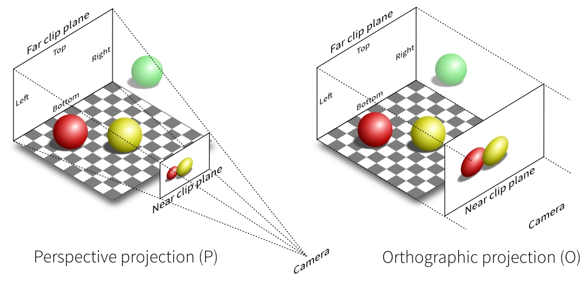

<!--
 * @Date: 2023-12-08 17:41:14
 * @LastEditors: wuyifan wuyifan@max-optics.com
 * @LastEditTime: 2023-12-12 20:58:02
 * @FilePath: /Obsidian Vault/graphics/详解Three中Matrix.md
-->

# Threejs 中各种矩阵的详解

## ModalMatrix (模型矩阵)
物体以自身为为原点建立坐标系，经过多次模型变换的结果为模型矩阵，常见的模型变换操作
例如平移、缩放、旋转、镜像等。

$$ ModalMatrix = M_i \times M_j \times M_k \times (...) $$

```javascript
const object = new Object3D()
// 移动(x,y,z)
object.applyMatrix4(new Matrix4().makeTranslation(x,y,z));
// 绕X轴旋转q
object.applyMatrix4(new Matrix4().makeRotationX(q));
// 缩放(j,k,i)
object.applyMatrix4(new Matrix4().makeScale(j,k,i));
// 移动(x1,y2,z2)
object.applyMatrix4(new Matrix4().makeTranslation(x1,y2,z2));
//...任意操作
```

最终这个矩阵会被分解成三部分，position、rotation、scale。按照先缩放，在旋转，最后移动的顺序进行变换

## MatrixWorld (世界矩阵)
世界矩阵是模型矩阵和父物体世界矩阵的乘积的结果。即
$$ obj.matrixWorld = obj.matrix \times obj.parent.matrixWorld $$

等同于

$$ obj.matrixWorld = obj.matrix \times obj.parent.matrix \times obj.parent.parent.matrix \times (...) $$

一般用于计算将物体的局部坐标系转为世界坐标系中的位置。

```javascript
// 例如模型object上的任意顶点为(x,y,z)
const vertexInWorld = new Vector3(x,y,z).applyMatrix4(object.matrixWorld);
// 求出的结果为世界坐标系下的该顶点位置
```

## MatrixWorldInverse (世界矩阵的逆)
世界矩阵的逆矩阵，用于计算世界坐标系下任意顶点在模型坐标系中的位置。与上面的例子作用相反，是将世界坐标系的顶点转化为模型坐标系下的顶点位置。
一般用于计算物体与物体之间的坐标系转换。

```javascript
// 现有模型object1和模型object2
// 模型object1上的任意顶点为(x,y,z)
// 求出该点在模型object2的坐标系中的位置
const vertex = new Vector3(x,y,z);
vertex.applyMatrix4(object1.matrixWorld); // 转化为世界坐标系
vertex.applyMatrix4(object2.matrixWorldInverse) // 转化为模型object2坐标系下的顶点位置
```

## ProjectionMatrix (投影矩阵)

投影矩阵分为两种，正交投影和透视投影。一般用于将三维坐标转换为视锥体坐标系下的坐标。



```javascript
// v为世界坐标系下任意一点值为(x,y,z)
const v = new Vector3(x,y,z);
// 转换为相机坐标系下
v.applyMatrix4(camera.matrixWorldInverse);
// 转为视锥体坐标系下
v.applyMatrix4(camera.projectionMatrix);

// 简便写法
v.project(camera);

```
在Three.js中，正交相机的投影矩阵与透视相机的投影矩阵不同。正交相机（Orthographic Camera）没有视角的概念，而是直接使用平行投影。这意味着图像中的对象不会因为距离相机的远近而改变大小。

正交相机的投影矩阵由四个边界（left, right, top, bottom）和两个裁剪面（near, far）定义。`zoom` 属性会影响这些边界值，从而改变投影矩阵的计算方式。

### 正交投影矩阵推导

一个标准的正交投影矩阵可以表示为：

$$
P = \begin{bmatrix}
\frac{2}{\text{right} - \text{left}} & 0 & 0 & -\frac{\text{right} + \text{left}}{\text{right} - \text{left}} \\
0 & \frac{2}{\text{top} - \text{bottom}} & 0 & -\frac{\text{top} + \text{bottom}}{\text{top} - \text{bottom}} \\
0 & 0 & -\frac{2}{\text{far} - \text{near}} & -\frac{\text{far} + \text{near}}{\text{far} - \text{near}} \\
0 & 0 & 0 & 1
\end{bmatrix} 
$$

### `zoom` 属性 对正交投影矩阵的影响

在正交相机中，`zoom` 属性会缩放 left、right、top 和 bottom 这四个边界值。假设 `zoom` 属性的默认值为 1，改变 `zoom` 属性会按照以下方式影响这些边界值：

$$
\text{left}_{\text{effective}} = \frac{\text{left}}{\text{zoom}}
$$

$$
\text{right}_{\text{effective}} = \frac{\text{right}}{\text{zoom}}
$$


$$
\text{top}_{\text{effective}} = \frac{\text{top}}{\text{zoom}}
$$

$$
\text{bottom}_{\text{effective}} = \frac{\text{bottom}}{\text{zoom}}
$$

将这些有效的边界值代入到正交投影矩阵公式中，得到：

$$
P = \begin{bmatrix}
\frac{2 \cdot \text{zoom}}{\text{right} - \text{left}} & 0 & 0 & -\frac{(\text{right} + \text{left}) \cdot \text{zoom}}{\text{right} - \text{left}} \\
0 & \frac{2 \cdot \text{zoom}}{\text{top} - \text{bottom}} & 0 & -\frac{(\text{top} + \text{bottom}) \cdot \text{zoom}}{\text{top} - \text{bottom}} \\
0 & 0 & -\frac{2}{\text{far} - \text{near}} & -\frac{\text{far} + \text{near}}{\text{far} - \text{near}} \\
0 & 0 & 0 & 1
\end{bmatrix} 
$$

正交投影和透视投影是两种不同的投影方法，它们的变换关系通常是通过一种称为“透视校正”（Perspective Correction）的方法来实现的。为了将正交投影矩阵转换为透视投影矩阵，我们需要了解两者的数学表示，并找到它们之间的关系。

### 透视投影矩阵

透视投影矩阵通常表示为：

$$
P_{\text{persp}} = \begin{bmatrix}
\frac{1}{\tan(\frac{\text{fov}}{2}) \cdot \text{aspect}} & 0 & 0 & 0 \\
0 & \frac{1}{\tan(\frac{\text{fov}}{2})} & 0 & 0 \\
0 & 0 & \frac{\text{far} + \text{near}}{\text{near} - \text{far}} & \frac{2 \cdot \text{far} \cdot \text{near}}{\text{near} - \text{far}} \\
0 & 0 & -1 & 0
\end{bmatrix} 
$$

### 变换关系推导

为了将正交投影矩阵转换为透视投影矩阵，我们需要引入一个透视校正矩阵。这个矩阵用来引入齐次坐标中的非线性变换，模拟透视效果。

假设透视校正矩阵为：

$$
M_{\text{persp correct}} = \begin{bmatrix}
1 & 0 & 0 & 0 \\
0 & 1 & 0 & 0 \\
0 & 0 & A & B \\
0 & 0 & -1 & 0
\end{bmatrix} 
$$

其中 $A$ 和 $B$ 是参数，用来调整透视效果。

我们可以将正交投影矩阵乘以透视校正矩阵来得到透视投影矩阵：

$$
P_{\text{persp}} = P_{\text{ortho}} \cdot M_{\text{persp correct}}
$$

#### 计算 \( A \) 和 \( B \)

为了使得矩阵转换正确，我们需要根据透视投影矩阵的形式确定 \( A \) 和 \( B \)。

从透视投影矩阵的第三行和第四行，我们知道：

$$
A = \frac{\text{far} + \text{near}}{\text{near} - \text{far}}
$$
$$ 
B = \frac{2 \cdot \text{far} \cdot \text{near}}{\text{near} - \text{far}}
$$

#### 确定投影矩阵

将这些值代入透视校正矩阵，并进行矩阵乘法：

$$
M_{\text{persp correct}} = \begin{bmatrix}
1 & 0 & 0 & 0 \\
0 & 1 & 0 & 0 \\
0 & 0 & \frac{\text{far} + \text{near}}{\text{near} - \text{far}} & \frac{2 \cdot \text{far} \cdot \text{near}}{\text{near} - \text{far}} \\
0 & 0 & -1 & 0
\end{bmatrix} 
$$

然后计算：

$$
P_{\text{persp}} = \begin{bmatrix}
\frac{2}{\text{right} - \text{left}} & 0 & 0 & -\frac{\text{right} + \text{left}}{\text{right} - \text{left}} \\
0 & \frac{2}{\text{top} - \text{bottom}} & 0 & -\frac{\text{top} + \text{bottom}}{\text{top} - \text{bottom}} \\
0 & 0 & -\frac{2}{\text{far} - \text{near}} & -\frac{\text{far} + \text{near}}{\text{far} - \text{near}} \\
0 & 0 & 0 & 1
\end{bmatrix} 
\cdot 
\begin{bmatrix}
1 & 0 & 0 & 0 \\
0 & 1 & 0 & 0 \\
0 & 0 & \frac{\text{far} + \text{near}}{\text{near} - \text{far}} & \frac{2 \cdot \text{far} \cdot \text{near}}{\text{near} - \text{far}} \\
0 & 0 & -1 & 0
\end{bmatrix}
$$

结果是：

$$
P_{\text{persp}} = \begin{bmatrix}
\frac{2}{\text{right} - \text{left}} & 0 & 0 & -\frac{\text{right} + \text{left}}{\text{right} - \text{left}} \\
0 & \frac{2}{\text{top} - \text{bottom}} & 0 & -\frac{\text{top} + \text{bottom}}{\text{top} - \text{bottom}} \\
0 & 0 & \frac{\text{far} + \text{near}}{\text{near} - \text{far}} & \frac{2 \cdot \text{far} \cdot \text{near}}{\text{near} - \text{far}} \\
0 & 0 & -1 & 0
\end{bmatrix}
$$

这就是透视投影矩阵。

## NormalMatrix (法线矩阵)
法线矩阵用于将物体坐标系下的法线转换为相机坐标系下的法线。一般应用于光照物体的光照计算。
是物体modalView的逆矩阵的转置矩阵。
```javascript
const normalMatrix = new Matrix3().getNormalMatrix(camera.matrixWorldInverse.clone().multiply(object.matrixWorld));
//或者直接使用object.modalView
const normalMatrix = new Matrix3().getNormalMatrix(object.matrixWorld);
```

## ViewPortMatrix (视口矩阵)

`ViewPortMatrix`（视口矩阵）在计算机图形学中是一个用于将标准化设备坐标（Normalized Device Coordinates，NDC）转换为屏幕坐标的矩阵。这个矩阵的作用是将渲染后的图像映射到实际显示设备（如屏幕）的坐标系中。标准化设备坐标系范围通常是 \([-1, 1]\) 之间，表示了视口的标准化范围。窗口坐标系是实际的屏幕像素坐标系，表示最终绘制图像的区域。

### 视口矩阵的推导

假设视口的参数为：
- \(x\) 和 \(y\)：视口的左下角在窗口坐标系中的位置。
- \(w\)：视口的宽度。
- \(h\)：视口的高度。

视口矩阵将标准化设备坐标 (NDC) 中的点 $(x_{ndc}, y_{ndc}, z_{ndc})$ 转换为窗口坐标系中的点 $(x_{win}, y_{win}, z_{win})$。

#### 标准化设备坐标 (NDC)

标准化设备坐标范围为 $[-1, 1]$：

$$ 
-1 \leq x_{ndc} \leq 1 
$$
$$
-1 \leq y_{ndc} \leq 1 
$$
$$
-1 \leq z_{ndc} \leq 1 
$$

#### 窗口坐标

窗口坐标的范围是视口指定的范围：

$$
x_{win} \in [x, x + w] 
$$
$$
y_{win} \in [y, y + h] 
$$

### 视口变换公式

我们需要将 NDC 范围 $[-1, 1]$ 映射到窗口坐标范围 $[x, x + w]$ 和 $[y, y + h]$。

#### 水平变换

首先将 $[-1, 1]$ 映射到 $[0, 1]$：
$$
x_{norm} = \frac{x_{ndc} + 1}{2} 
$$

然后将 $[0, 1]$ 映射到 $[x, x + w]$：
$$
x_{win} = x + x_{norm} \cdot w 
$$
$$
x_{win} = x + \left(\frac{x_{ndc} + 1}{2}\right) \cdot w 
$$

同理，垂直变换：
$$
y_{norm} = \frac{y_{ndc} + 1}{2} 
$$
$$
y_{win} = y + y_{norm} \cdot h 
$$
$$
y_{win} = y + \left(\frac{y_{ndc} + 1}{2}\right) \cdot h 
$$

深度变换（假设 $[0, 1]$ 映射到 $[0, 1]$）：
$$
z_{win} = \frac{z_{ndc} + 1}{2} 
$$

### 视口矩阵的构建

我们可以将上述变换公式表示为矩阵形式：

$$ 
M_{viewport} = \begin{bmatrix}
\frac{w}{2} & 0 & 0 & x + \frac{w}{2} \\
0 & \frac{h}{2} & 0 & y + \frac{h}{2} \\
0 & 0 & \frac{1}{2} & \frac{1}{2} \\
0 & 0 & 0 & 1
\end{bmatrix} 
$$

该矩阵的作用是：
- 将 x 坐标从 $[-1, 1]$ 映射到 $[x, x + w]$。
- 将 y 坐标从 $[-1, 1]$ 映射到 $[y, y + h]$。
- 将 z 坐标从 $[-1, 1]$ 映射到 $[0, 1]$。


