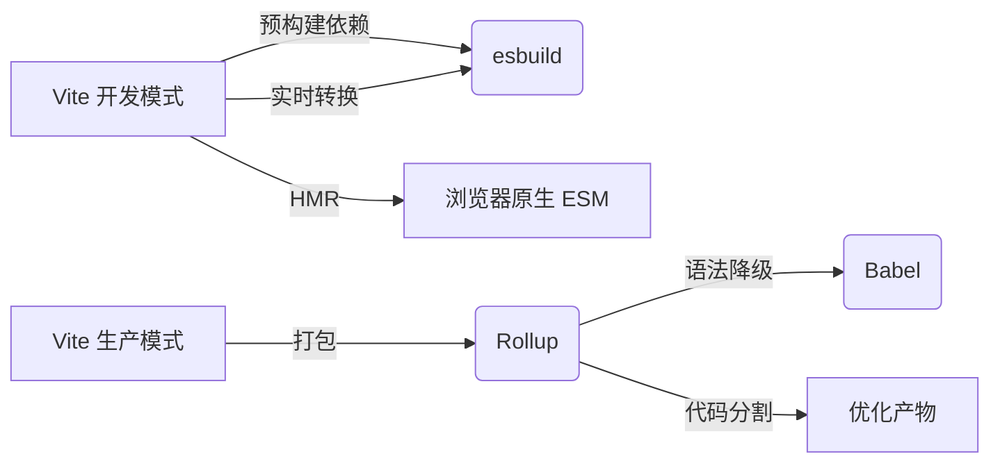

# Architecture 前端工程化

```mermaid
graph LR
  A[Vite 开发模式] -->|预构建依赖| B(esbuild)
  A -->|实时转换| B
  A -->|HMR| C[浏览器原生 ESM]
  D[Vite 生产模式] -->|打包| E(Rollup)
  E -->|语法降级| F(Babel)
  E -->|代码分割| G[优化产物]
```
