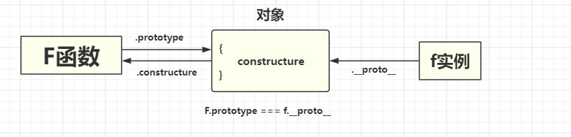

# JavaScript

## 数据类型

基本类型 (7 种)： number、string、boolean、undefined、null、symbol(ES6),bigint(ES2020)

引用类型： object（包括 Array、Function、Date、RegExp、Math、Error 等）

## 类型判断

typeof 可以判断基本类型，但是对于 null 和 object 类型，返回的都是 object。

instanceof 可以判断对象的类型，但是无法判断基本类型。

Object.prototype.toString.call() 可以判断所有类型。

判断数组：instanceof、 Array.isArray()。

## 对象判断

=== 和 Object.is()，两者的区别：Object.is() 可以判断 NaN 和 +0 和 -0。


## 闭包

闭包是指一个`函数`能够访问并操作其`词法作用域`之外的变量。

核心条件：

1. **函数嵌套**：内部函数引用外部函数的变量
2. **内部函数引用外部变量​​**
3. **外部函数执行后，闭包依然保留对内部变量的访问**

作用：
* 延长变量的生命周期
* 封装私有变量和方法

隐患：
* 内存泄漏
* 循环+ 闭包

场景：
* 柯里化缓存
* 防抖/节流
* 模块封装

## 防抖和节流

防抖： 一定时间段内持续触发事件时，事件处理函数才会执行一次，如果设定的时间到来之前，再次触发了事件，则重新记时。

​​防抖​​关注“最后一次触发”，适用于避免重复执行高频操作。

```js
function debounce(func, delay) {
  let timer = null;
  return function (...args) {
    clearTimeout(timer);
    timer = setTimeout(function () {
      func.apply(this, args);
    }, delay);
  };
}
```

节流： 当持续触发事件时，保证一定时间段内只调用一次事件处理函数。

​​节流​​关注“均匀分散执行”，适用于限制高频操作的执行频率。

```js
function throttle(func, delay) {
  let lastTime = 0;
  return function (...args) {
    const now = Date.now();
    if (now - lastTime >= delay) {
      func.apply(this, args);
      lastTime = now;
    }
  };
}
```

## 原型链

**原型继承** ：从 object 中读取一个缺失的属性时，JavaScript 会自动从原型中获取该属性。

### `[[Prototype]]` 与 `__proto__`

`__proto__` 是 `[[Prototype]]` 的 getter/setter。(即使用 `__proto__` 可以访问到 `[[Prototype]]`);

| **维度**        | **`[[Prototype]]`**                              | **`__proto__`**                                  |
|-----------------|------------------------------------------------|------------------------------------------------|
| **性质**        | ECMAScript 规范中定义的**内部属性**              | 浏览器实现的**非标准属性**（可读写）            |
| **可见性**      | 不可直接访问，属于语言底层机制                  | 可通过对象实例访问（如 `obj.__proto__`）         |
| **标准性**      | 语言规范强制要求所有对象实现                    | 非标准特性，但被大多数浏览器支持                |
| **修改方式**    | 通过 `Object.setPrototypeOf()` 等标准方法修改   | 直接赋值（如 `obj.__proto__ = newProto`）       |


### F.prototype 与 f.__proto__

只有函数对象才有 `F.prototype` 属性，指向只有一个属性`constructor `的对象。

只有实例对象才有 `f.__proto__` 属性，指向构造函数的 `prototype`。




## Promise

## Proxy 

## 事件循环
1. 遇到同步代码，立即执行
2. 遇到宏任务,放入到宏任务队列里.
3. 遇到微任务,放入到微任务队列里.
4. 当执行栈执行完后,会先执行微任务队列里的所有任务.
5. 当微任务队列里的所有任务执行完后,会去执行宏任务队列里的第一个任务.
6. 重复上述过程.
