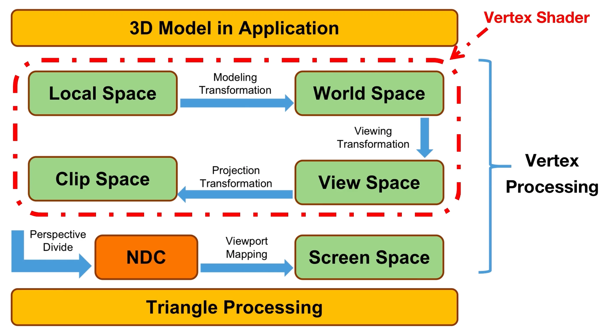
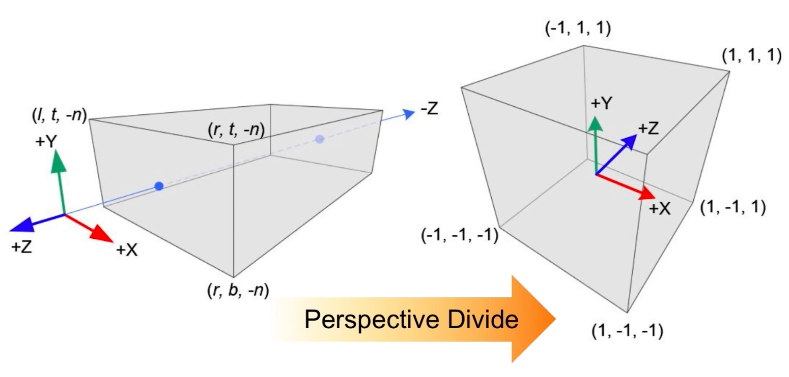
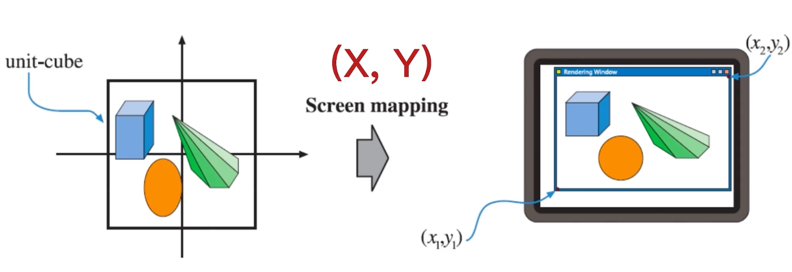
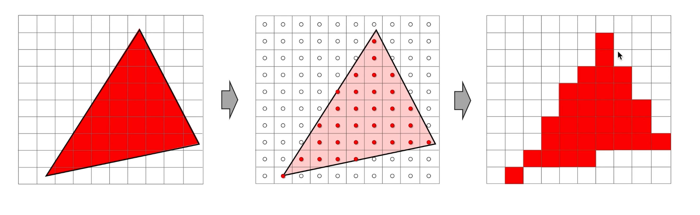
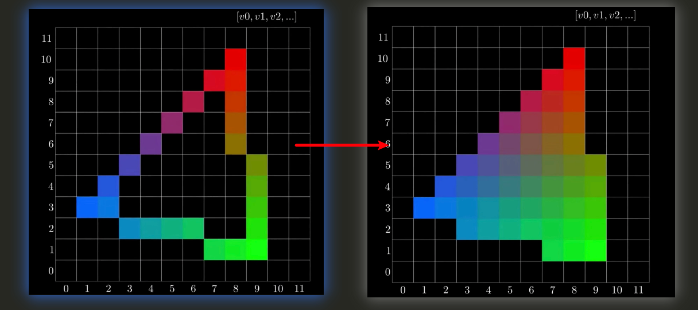

# 渲染管线概述

## 渲染管线流程

### Data Processing （CPU）

准备好场景数据，相机位置，视锥体，几何体信息，光源贴图等

将需要的数据传入显存

设置渲染状态，使用的哪个vertex Shader，使用的什么光源等

最后调用drawcall绘制
### Vertex Processing （GPU）

所有顶点都会执行vertex shader，顶点着色器会根据顶点数据和顶点着色器代码来计算每个顶点的位置，

将物体所在的本地空间转换到世界空间，在转换成视图空间，再转换为裁切空间，最后转换到屏幕空间。

从本地空间到裁切空间的变换过程被称作MVP变换，在裁切空间内的片原会进行下一个阶段，裁切空间外的片原会被丢弃。
对裁切空间采用透视除法，将裁切空间归一化到-1到1之间的立方体中

接下来进行视口映射，将裁切空间中的顶点映射到屏幕空间。

### Triangle Processing （GPU）

#### Primitive Assembly 图原装配

将顶点数据转换为图元，图元是组成图形的最小单位，图元可以是点、线、三角形、四边形等

#### Face Culling 图元剔除

将图元从屏幕空间中剔除，剔除的图元不会被绘制到屏幕上,分为正面剔除和背面剔除和不剔除

### Rasterization 光栅化 （GPU）

将图元转换为片元的过程就是光栅化

通过顶点数据通过插值计算出边缘数据，采用中点法即检查像素中心是否被三角形所覆盖

### Fragment Processing （GPU）

每一个片源都会执行片元着色器，片元着色器会根据片源数据和片元着色器代码来计算每个片源的最终颜色

代码内容包可包含光照、纹理混合、雾、反射等等操作计算出的结果（颜色），最终填入片原

如果是纯色，则根据顶点颜色先插值出边缘的颜色，再将内部区域逐行插值填色

### FrameBuffer Operations （GPU）

每一个像素都会经过一系列测试，来决定它是否该被显示出来

裁切测试 -> alpha测试 -> 模板测试 -> 深度测试 -> 混合

其中 模板测试写入到深度缓冲区，深度测试写入到深度缓冲区，混合颜色写入到颜色缓冲区

这个三个缓冲区的组合叫做帧缓冲区，渲染管线会将渲染结果写入帧缓冲区，最后将帧缓冲区中的内容写入到显示器上
